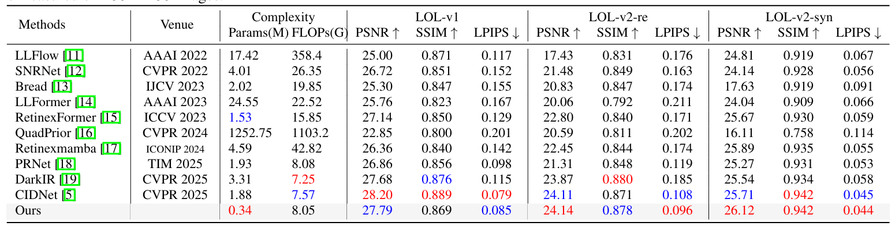
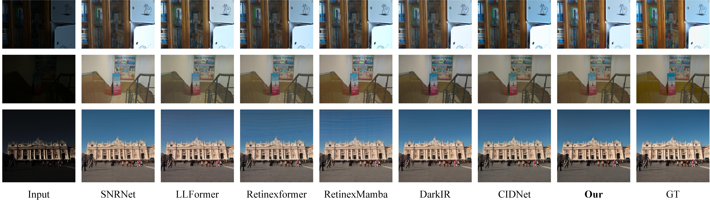
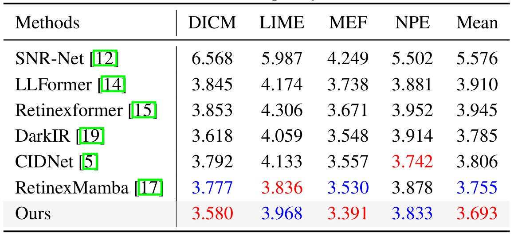

# ISGNet
""
---------------------

- Our code (Model and Train) will be sorted and uploaded

## Abstract
We will publish it after receiving our paper
## Result

- Our results on the reference dataset can be downloaded from [Baidu Cloud](https://pan.baidu.com/s/185T38KDyIkA7KnmhNpAGyg?pwd=ISGN)(code:ISGN) or[ Google Cloud](https://drive.google.com/file/d/1tFrmGyaBv-m4MK0Tl3ct3FOblFWX0qTo/view?usp=drive_link).

- Our results on the no-reference dataset can be downloaded from [Baidu Cloud](https://pan.baidu.com/s/1MpTuRdBItABnw-rzyW6Rmg?pwd=ISGN)(code:ISGN) or [Google Cloud](https://drive.google.com/file/d/1aVN3-wazQcqfEwiMeOkgXLl4Aa5coJnW/view?usp=drive_link).

<details close>
<summary><b>Performance on LOL datasets</b></summary>



</details>

<details close>
<summary><b>Visual results on the LOL dataset</b></summary>

The LOL-v1 dataset is listed from top to bottom; LOL-v2 real dataset; Images in the LOL-v2 syn dataset



</details>

<details close>
<summary><b>Performance on LIME, DICM, MEF, NPE, and VV datasets</b></summary>



</details>
  

## 1. Create Environment

- Make Conda Environment and Install Dependencies

```shell
conda create -n ISGNet-LLIE python=3.10 -y
conda activate ISGNet-LLIE
conda install pytorch==2.7.1 torchvision torchaudio pytorch-cuda=12.8 -c pytorch -c nvidia
pip install -r requirements.txt
```

- Obtain the structural diagram

Refer to the following warehouse for reference
https://github.com/Attila94/CIConv


## 2. Prepare Dataset

Download the following datasets:

LOL-v1 [Baidu Disk](https://pan.baidu.com/s/1ZAC9TWR-YeuLIkWs3L7z4g?pwd=cyh2) (code: `cyh2`), [Google Drive](https://drive.google.com/file/d/1L-kqSQyrmMueBh_ziWoPFhfsAh50h20H/view?usp=sharing)

LOL-v2 [Baidu Disk](https://pan.baidu.com/s/1X4HykuVL_1WyB3LWJJhBQg?pwd=cyh2) (code: `cyh2`), [Google Drive](https://drive.google.com/file/d/1Ou9EljYZW8o5dbDCf9R34FS8Pd8kEp2U/view?usp=sharing)


<details close>
<summary><b>Organize these datasets as follows: </b></summary>

```
    |--datasets   
    |    |--LOLdataset
    |    |    |--our485
    |    |    |    |--low
    |    |    |    |    |--2.png
    |    |    |    |    |--5.png
    |    |    |    |     ...
    |    |    |    |--high
    |    |    |    |    |--2.png
    |    |    |    |    |--5.png
    |    |    |    |     ...
    |    |    |    |--low_s
    |    |    |    |    |--2.png
    |    |    |    |    |--5.png
    |    |    |    |     ...
    |    |    |--eval15
    |    |    |    |--low
    |    |    |    |    |--1.png
    |    |    |    |    |--22.png
    |    |    |    |     ...
    |    |    |    |--high
    |    |    |    |    |--1.png
    |    |    |    |    |--22.png
    |    |    |    |     ...
    |    |    |    |--low_s
    |    |    |    |    |--1.png
    |    |    |    |    |--22.png
    |    |    |    |     ...    
    |    |--LOLv2
    |    |    |--Real_captured
    |    |    |    |--Train
    |    |    |    |    |--Low
    |    |    |    |    |    |--00001.png
    |    |    |    |    |    |--00002.png
    |    |    |    |    |     ...
    |    |    |    |    |--Normal
    |    |    |    |    |    |--00001.png
    |    |    |    |    |    |--00002.png
    |    |    |    |    |     ...
    |    |    |    |    |--Low_s
    |    |    |    |    |    |--00001.png
    |    |    |    |    |    |--00002.png
    |    |    |    |    |     ...    
    |    |    |    |--Test
    |    |    |    |    |--Low
    |    |    |    |    |    |--00690.png
    |    |    |    |    |    |--00691.png
    |    |    |    |    |     ...
    |    |    |    |    |--Normal
    |    |    |    |    |    |--00690.png
    |    |    |    |    |    |--00691.png
    |    |    |    |    |     ...
    |    |    |    |    |--Low_s
    |    |    |    |    |    |--00690.png
    |    |    |    |    |    |--00691.png
    |    |    |    |    |     ...    
    |    |    |--Synthetic
    |    |    |    |--Train
    |    |    |    |    |--Low
    |    |    |    |    |   |--r000da54ft.png
    |    |    |    |    |   |--r02e1abe2t.png
    |    |    |    |    |    ...
    |    |    |    |    |--Normal
    |    |    |    |    |   |--r000da54ft.png
    |    |    |    |    |   |--r02e1abe2t.png
    |    |    |    |    |    ...
    |    |    |    |    |--Low_s
    |    |    |    |    |   |--r000da54ft.png
    |    |    |    |    |   |--r02e1abe2t.png
    |    |    |    |    |    ...    
    |    |    |    |--Test
    |    |    |    |    |--Low
    |    |    |    |    |   |--r00816405t.png
    |    |    |    |    |   |--r02189767t.png
    |    |    |    |    |    ...
    |    |    |    |    |--Normal
    |    |    |    |    |   |--r00816405t.png
    |    |    |    |    |   |--r02189767t.png
    |    |    |    |    |    ...
    |    |    |    |    |--Low_s
    |    |    |    |    |   |--r00816405t.png
    |    |    |    |    |   |--r02189767t.png
    |    |    |    |    |    ...
    |    |--DICM
    |    |    |--Low
    |    |    |    |--01.jpg
    |    |    |    |--02.jpg
    |    |    |    |     ...
    |    |    |--Low_s
    |    |    |    |--01.jpg
    |    |    |    |--02.jpg
    |    |    |    |     ...
    |    |  ...   

```

</details>


We also provide download links for LIME, NPE, MEF, DICM, and VV datasets that have no ground truth:

[Baidu Disk](https://pan.baidu.com/s/1IPHseGVdWgUMeJMWCE6Flg?pwd=yIPR) (code: `yIPR`)
 or [Google Drive](https://drive.google.com/drive/folders/141Do9QmDPY3aqvZ2gG8LUanMu20W1aeR?usp=drive_link)

## 3. Testing

Obtain our weights from the link below and place them in the weights folder

 [Baidu Cloud](https://pan.baidu.com/s/1L-I9TBsKZ4x4OfpqHQ9aPQ?pwd=ISGN)(code:ISGN) or[ Google Cloud](https://drive.google.com/file/d/1ajr-JYc1KCHTpw6p4tYL-JvobdmeOyFb/view?usp=drive_link).


<details close>
<summary><b>Test these datasets as follows: </b></summary>

```shell
# Test our parameters and floating-point computational complexity
python net_test.py

# LOL-v1
python eval.py --lol --test

# LOL-v2-real
python eval.py --lol_v2_real --testv

# LOL-v2-synthetic
python eval.py --lol_v2_syn --test

# DICM
python eval.py --unpaired --DICM

# LIME
python eval.py --unpaired --LIME

# MEF
python eval.py --unpaired --MEF

# NPE
python eval.py --unpaired --NPE

# VV
python eval.py --unpaired --VV

```

</details>

## 4. Measure

<details close>
<summary><b>Measure these results as follows: </b></summary>

```shell

python measure.py --lol --use_GT_mean

python measure.py --lol_v2_real

python measure.py --lol_v2_syn

python measure_niqe_bris.py --DICM

python measure_niqe_bris.py --LIME

python measure_niqe_bris.py --MEF

python measure_niqe_bris.py --NPE

python measure_niqe_bris.py --VV


```

</details>


## 5. Acknowledgments

We thank the following article and the authors for their open-source codes.

```shell
@inproceedings{37.yan2025hvi,
  title={Hvi: A new color space for low-light image enhancement},
  author={Yan, Qingsen and Feng, Yixu and Zhang, Cheng and Pang, Guansong and Shi, Kangbiao and Wu, Peng and Dong, Wei and Sun, Jinqiu and Zhang, Yanning},
  booktitle={Proceedings of the Computer Vision and Pattern Recognition Conference},
  pages={5678--5687},
  year={2025}
}
```